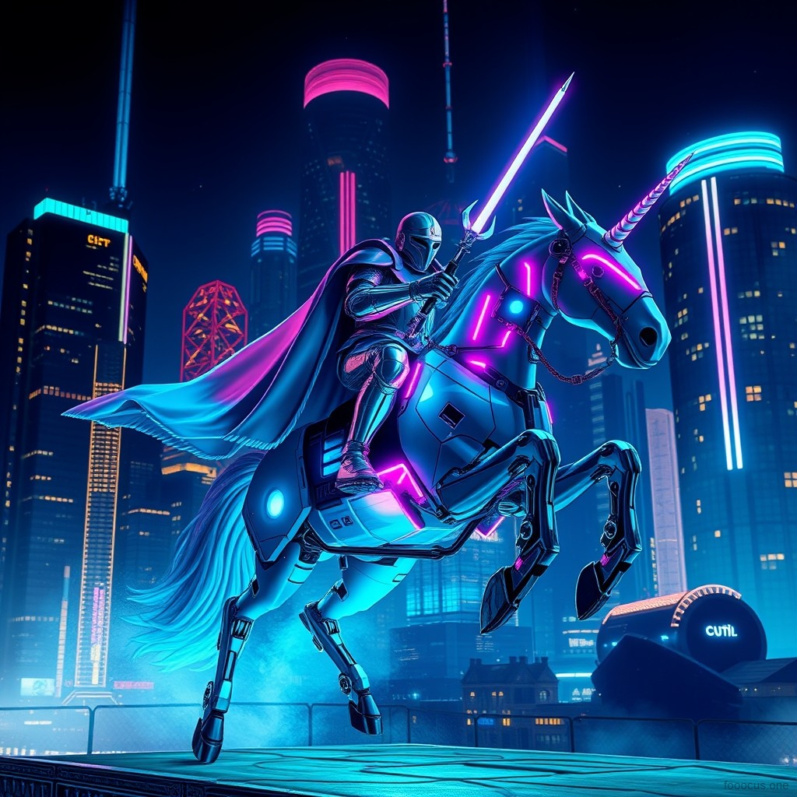
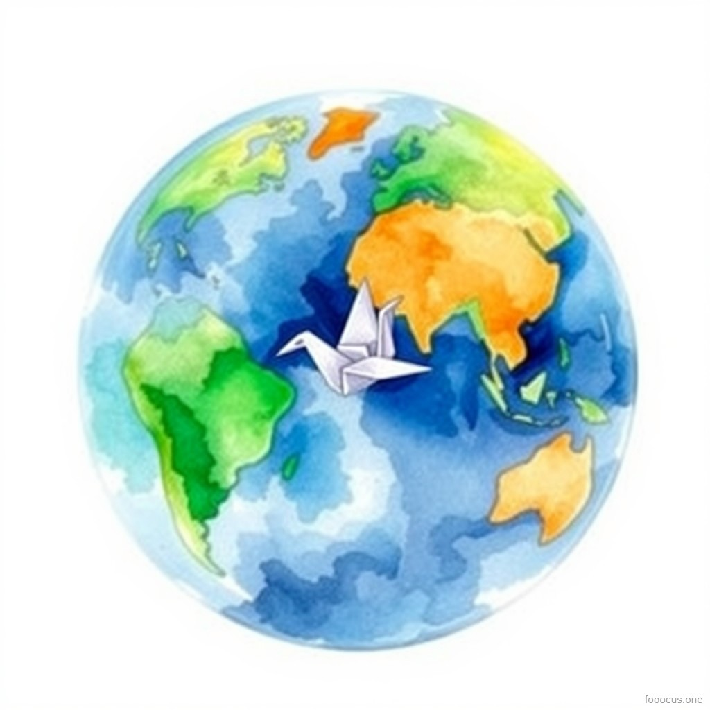
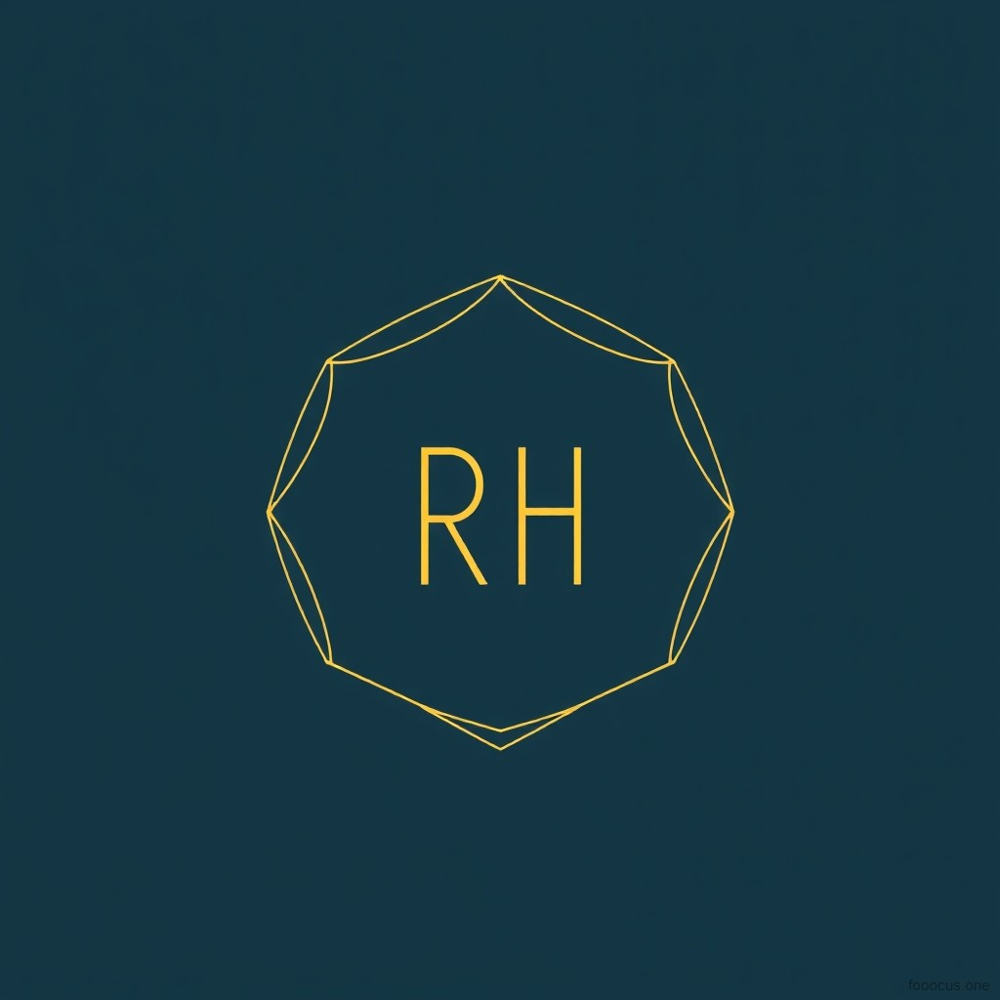
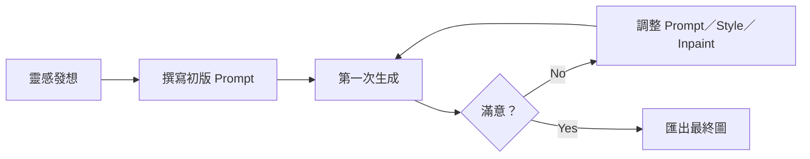

## 創作流程文字敘述

1. **靈感發想**  
   - 觀察社群平台熱門視覺風格，決定三種場景：  
     1. Cyberpunk 未來感  
     2. Watercolor 手繪溫暖  
     3. Minimal 極簡識別  

2. **初步設定**  
   - 在 Fooocus 桌面版開啟 **Txt2Img** 模式  
   - 畫布：1:1（1024×1024），步數：4–8  
   - 載入 Style Presets（Cyberpunk／Watercolor／Minimal）  

3. **第一次生成 & 效果檢視**  
   - 輸入英文 Prompt → 「Generate Image」  
   - 檢視：  
     - 色彩飽和度  
     - 主體輪廓清晰度  
     - 構圖是否符合預期  

4. **迭代優化**  
   - **Canny2Img**：第一組「騎士」加入邊緣遮罩，強化輪廓  
   - **Inpainting**：  
     - 「Logo」微調線條斷裂  
     - 「Watercolor」補上雲彩漸層  
   - 調整 Prompt 關鍵詞（如加入 `“soft glow”`、`“high contrast”`），重複生成直到滿意  

5. **最終匯出**  
   - 挑選三組最佳圖像，匯出 PNG（最高解析度）  
   - 同步保存 Prompt／參數截圖  
   - 整理成 PDF

| 組別 | 應用情境         | 輸入（Prompt & 設定）                                                                                                                          | 輸出（圖片截圖）           |
| ---- | ---------------- | -------------------------------------------------------------------------------------------------------------------------------------------- | ---------------------- |
| 1    | Instagram 廣告   | - Prompt: `"A futuristic knight riding a mechanical unicorn against a neon-lit city nightscape"` - Style: Cyberpunk - Canny: original edge mask - Inpaint: add light reflection effects |  |
| 2    | 報告簡報封面     | - Prompt: `"A hand-painted watercolor Earth with a paper crane soaring at its center"` - Style: Watercolor - No Inpaint/Canny             |  |
| 3    | 個人品牌 Logo    | - Prompt: `"Minimalist line-art logo featuring the initials RH with a geometric gradient background"` - Style: Minimal - Inpaint: fine-tune line details |  |

