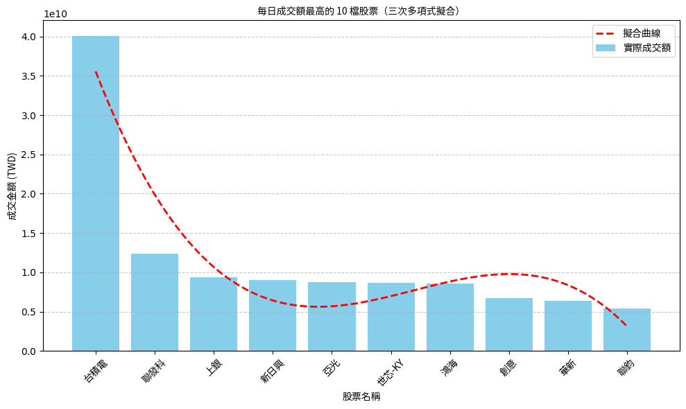
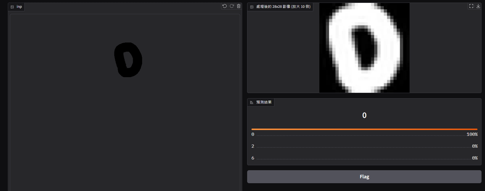
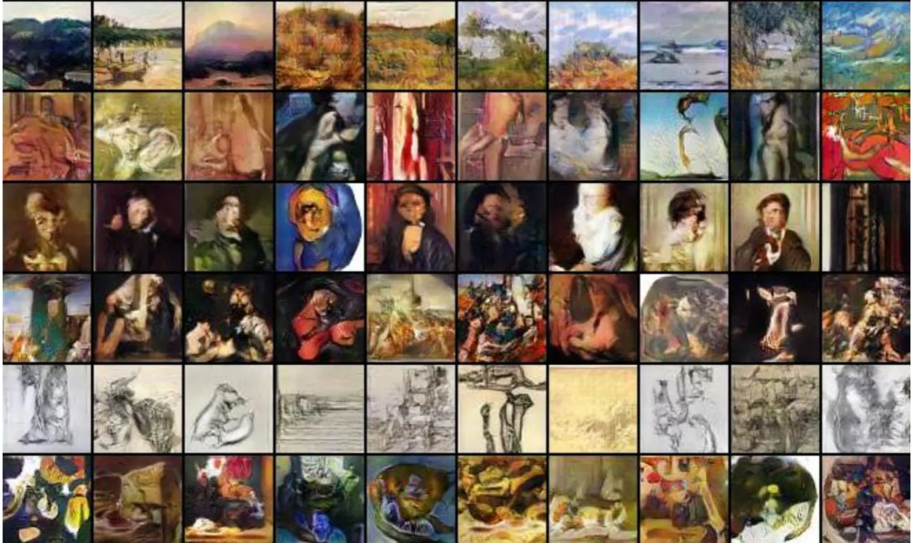
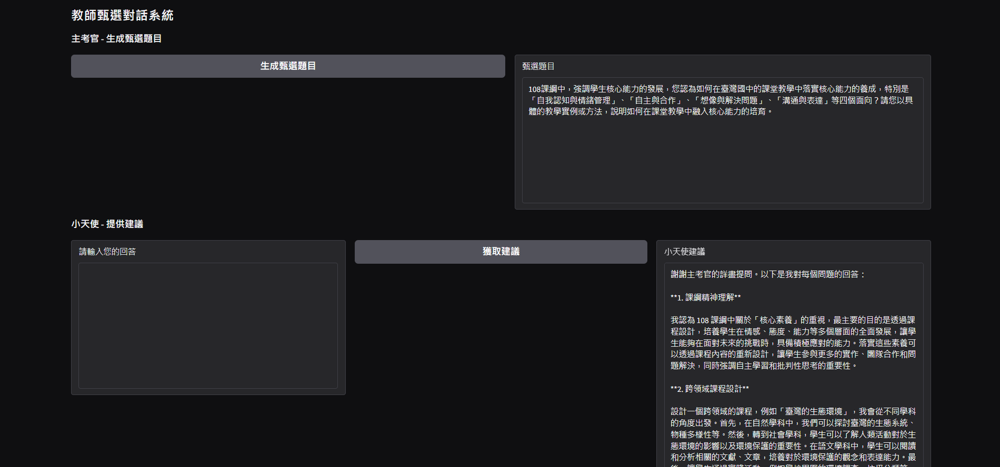
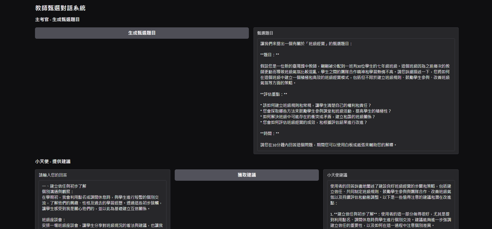
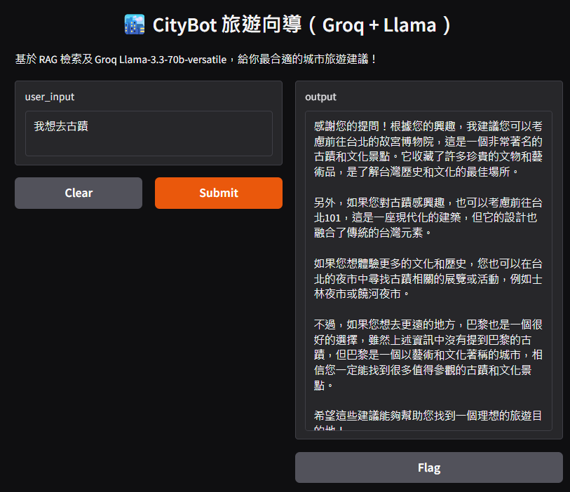
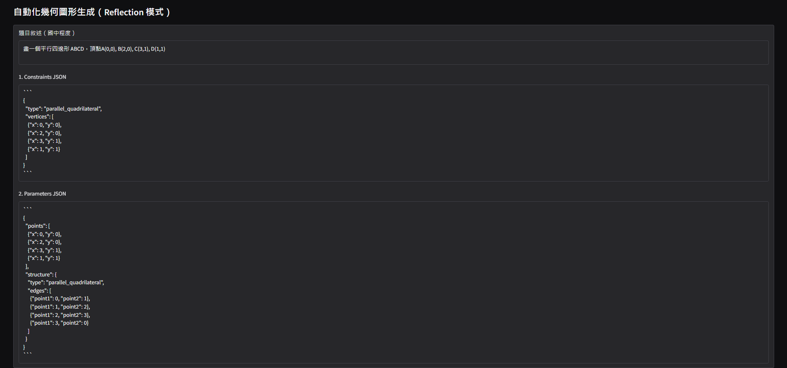
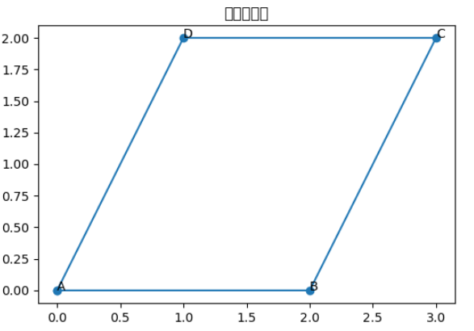

# GenerativeAI 

## 一般資訊 
姓名：黃國展

系級：資工 115 

課程名稱：生成式AI：文字與圖像生成的原理與實務_國立臺灣師範大學衛星課程

修課學期：113-2

## 使用說明 
 - 為節省時間，建議在 google colab 裡面開啟，以減少架設虛擬系統所需時間

## 作業

### week1
**1. colab 網址 :**
[NTNU_41147047S_CSIE_黃國展_台股每日前十大成交量的擬合曲線.ipynb](https://colab.research.google.com/drive/10wTASH33ZNQgUuLIxnmcH6ymNYb-TrAF?usp=drive_linkLinks)

**2. 作業相關重點說明**
 - 主要部分 : 參考每日台股前十大交易量股票，並且進行計算，繪製一個一元三次方程式

 - 額外部分 : 使用繁體中文進行圖表的標註、串接 api 以便獲得運行時當日的股票資訊、使用擬合的方式計算出最接近當日成交量的方程式

**3. 以下為運行後的截圖**

### week2
**1. colab 網址 :**
[NTNU_41147047S_CSIE_黃國展_第一個神經網路.ipynb](https://colab.research.google.com/drive/1BpF-ga4kQRrdqR6OyWO_Aq1ITk7iB7vQ#scrollTo=FWK0fgKgCHa7)
**2. 主題與額外內容**
該作業主要是訓練出一個可以辨識 0~9 的神經網路，以下為有更改的內容

 - 修改神經元參數 => [16,16,16]
 - 利用 ReduceLROnPlateau 以及 SGD 動態調整 learning rate
 - model.fit 部分呼叫函式，當 loss 多次未改善時，減少 learning rate
 - 針對圖形前處理進行改進，避免文字過小縮小後細節缺失等問題

**3. 重要截圖**

圖片前處理調整比較圖

運行結果

### week3
**1. 第三周作業，藝術相關影像生成 ( 以 GAN 的方式實現)**\
**2. ArtGAN playground**
    - [連結](https://github.com/cs-chan/ArtGAN)\
    - 模型名稱：ArtGAN（實作版本為 BigGAN）\
    - 來源：由 nateraw 在 Hugging Face Spaces 上提供互動式操作平台\
    - 簡介：
ArtGAN 是一種基於 BigGAN 架構的生成對抗網路，可生成高解析度（512x512）圖片。它採用條件式生成，可以根據你選擇的「類別」來產生相對應的圖片，例如：狗、貓、金魚、城市、手風琴等。\
**3. 相關輸出紀錄**
    - 輸入關鍵字順序為 : \
        (1) 抽象畫
        (2) 城市風景畫
        (3) 類型畫
        (4) 插畫
        (5) 風景畫
        (6) 肖像畫
        (7) 宗教畫
        (8) 素描與習作
        (9) 靜物畫。

    - 圖片輸出如下 : 
    

**4. 為何現在較少人使用 GAN 進行圖片生成 ?**

- 穩定性差：GAN 在訓練過程中容易出現模式崩潰（mode collapse）或不穩定的訓練現象。

- 品質不如 Diffusion 模型：像是 Stable Diffusion、DALL·E 2、Midjourney 這些 diffusion-based 模型在生成圖片的品質與細節上明顯優於 GAN。

- 可控性較差：GAN 難以精準控制圖片風格或內容，而 diffusion 模型通常支援文字提示（text prompt），更容易做出你要的結果。

- 資源需求高：高品質 GAN（如 StyleGAN3、BigGAN）需要大量 GPU 訓練與生成，而 diffusion 模型經過優化後在低資源裝置也可運行。

### week4、6、7
**1. colab 網址 :**
[NTNU_41147047S_CSIE_黃國展_教甄主考官小天使系統.ipynb](https://colab.research.google.com/drive/16C-mYX6QEWY4Z9uek8rVzwRYj06-tBVX?usp=sharing)

**2. 主題與額外內容**
該作業有以下功能
week 4 
 - 可以進行問題回答以及對話
week 6
 - 按下生成甄選題目可以隨機生成一個臺灣國中教師甄選的題目
 - 可以針對該題目進行回答
 - 獲取建議按鍵可以讓小天使告訴你可以如何回答問題
week 7
 - 可以繼續順著回答進行提問以及給予全面性的建議

**3. 重要截圖**

實際運行截圖
- 小天使我不會這題版

- 小天使幫你給建議版

以下為該截圖的詳細輸出 ( 該網頁可以透過滾輪來檢視所有文字 )\
[輸出.md](result/HW03/result.md)

### week8 
**1. colab 網址 :**
[NTNU_41147047S_CSIE_黃國展_城市導覽.ipynb](https://colab.research.google.com/drive/1YXgrpWl-309hqjuFhQxdTgcUntFr7EmA?hl=zh-tw#scrollTo=iC8ai0QHGeTD)
**2. 主題與額外內容**
該作業主題為城市導覽
 - 目前為小資料版本，僅有台北、京都以及巴黎的部分資料 
 - 可以下載 .zip 檔案並且進行解壓縮後讀取
 - 用戶在輸入資訊後，可以得到相關的旅遊建議 

**3. 重要截圖**

運行結果

### week9 
**1. colab 網址 :**
[NTNU_41147047S_CSIE_黃國展_幾何圖形生成器.ipynb](https://colab.research.google.com/drive/1odedxGwwxyGc9la_g1f4X93JZx7W27TW?hl=zh-tw#scrollTo=DuCD_IH2ReL3)
**2. 主題以及額外內容**
該作業主題為幾何圖形生成
 - 將用戶輸入的題目進行解析，用 JSON 來進行表示並且加上幾何限制
 - 將 JSON 檔案中的各項幾何元素 ( 如頂點 )，加上座標，或是將點跟點的連線進行確認
 - 將前一步的資訊作為參考，並且生成對應的程式
 - 閱讀程式後進行反饋
**3. 重要截圖**

註 : 詳細結果請參照 `./result/Week9/result.md`
\
\

註 : 圖中方框產生原因係因繁體中文包未安裝，用戶可以在自己的環境的 plt 加載繁體中文的 .ttf 以解決問題